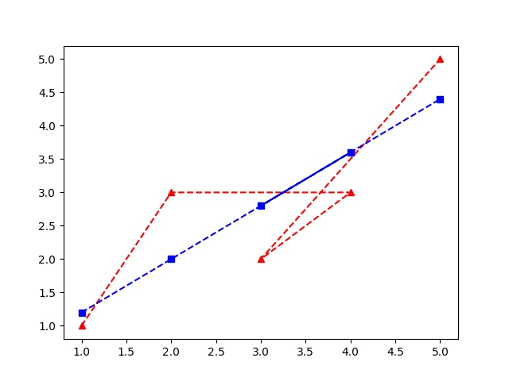
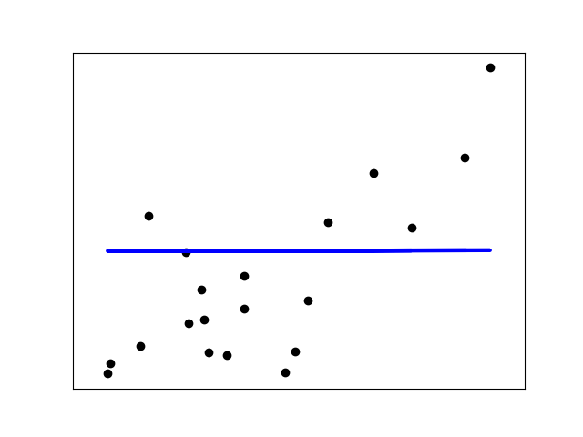
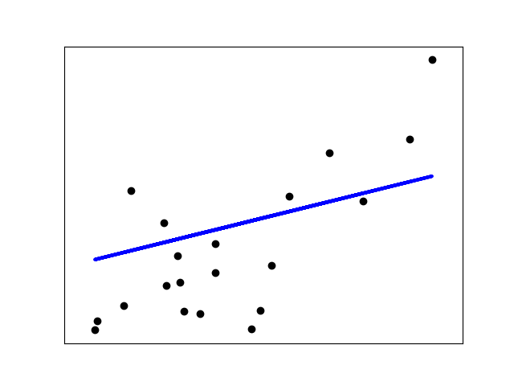

# **A Tutorial on Regression with examples**

## **Linear Regression**

### *Introduction*
Simple linear regression is a statistical method that allows us to summarize and study relationships between two continuous (quantitative) variables:

One variable, denoted x, is regarded as the predictor, explanatory, or independent variable.
The other variable, denoted y, is regarded as the response, outcome, or dependent variable.

The regression equation is written as Y = a + bX +e
Y is the value of the Dependent variable (Y), what is being predicted or explained
a or Alpha, a constant; equals the value of Y when the value of X=0
b or Beta, the coefficient of X; the slope of the regression line; how much Y changes for each one-unit change in X.

X is the value of the Independent variable (X), what is predicting or explaining the value of Y
e is the error term; the error in predicting the value of Y, given the value of X (it is not displayed in most regression equations).

**Metrics of performance:**

MSE - MSE is a measure of error calcualted by 

R2 - R2 is a measure of association; it represents the percent of the variance in the values of Y that can be explained by knowing the value of X. r2 varies from a low of 0.0 (none of the variance is explained), to a high of +1.0 (all of the variance is explained).

Explained variance score = 1 - var(y_hat - y_true) / var(y_true)

### *Only python*
The code for implementing and using linear regression written in python from scratch can be found in the reg-python dir.
The data dir inside reg-python contains a small example to help understand the model and code.
Following is a plot of the the data (in red) and output of the regression model (in blue) :

### *Using Scikit*
The code for implementing and using linear regression written in python using scikit library can be found in the reg-scikit dir.
The example dataset (diabetes dataset) used to demostrate the code and model is available in scikit and can be imported as shown in the code.
Following is a plot of the the data (in black) and output of the regression model (in blue) :

The MSE for this dataset using linear regression is 2548.07.
Varaince score is 0.47

## **ElasticNet Regression**

### *Using Scikit*
The code for implementing and using Elasticnet regression written in python using scikit library can be found in the reg-scikit dir.
The example dataset (diabetes dataset) used to demostrate the code and model is available in scikit and can be imported as shown in the code.
Following is a plot of the the data (in black) and output of the regression model (in blue) :

The MSE for this dataset using Elasticnet Regression model is 5551.83
varaince score is -0.15

## **Lasso Regression**

### *Using Scikit*
The code for implementing and using Lasso regression written in python using scikit library can be found in the reg-scikit dir.
The example dataset (diabetes dataset) used to demostrate the code and model is available in scikit and can be imported as shown in the code.
Following is a plot of the the data (in black) and output of the regression model (in blue) :

The MSE for this dataset using Lasso Regression model is 3482.77
varaince score is 0.28

